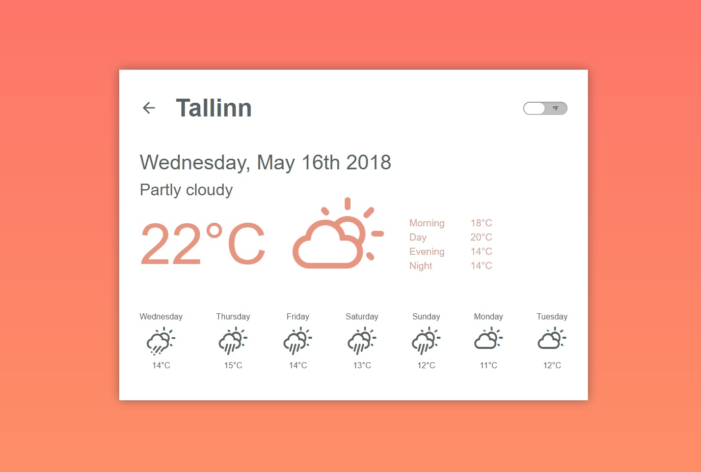

# Weather Application on ReactJS


## Description
Frontend React JS Application that represents API weather data.

Live Demo [here](https://mst-crew-dev.github.io/react-weather-app-build/).

### Main Features
* Provide 7-days forecast starting from today;
* City can be selected by name or current geo-position;
* User will be notified if geo-position is not supported by device or is Off on device;
* User will be notified if city can't be located (API Error response);
* In the history list temperature is shown for a daytime;
* 'Current weather' section show temperature and icon depending on current daytime;
* 'Scale type' control switch temperature from celsius to fahrenheit and vise versa;
* App state will be restored if page will be reloaded (if any location was selected by name or geo-coordinates user will see saved forecast and data will be updated in bachground);
* During retrieving data from API user will see Loader;
* Responsive Design - support Mobile / Tablet / Desktop devices.


### Browser Support
CSS Grid Layout is used in application. 
The grid properties are supported in all modern browsers:
* Chrome - 57.0
* Firefox - 52.0
* Safari - 10
* Opera - 44
* IE - 16.0

### API
Application use [APIXU Weather API](https://www.apixu.com/) service with FREE Developer Plan:
* API Calls per Month - 10 000;
* Current Weather;
* Weather Forecast (7 days);
* Weather History (7 days).

### Icons

#### - For Weather condition 
APIXU Api provide own icons for weather condition states, but ones are presented in PNG format and have small resolution. 
So [Weather Themed Icons Font](http://erikflowers.github.io/weather-icons/) was used and mapped with APIXU icon's codes.

#### - For Actions
For action buttons [material.io](https://material.io) icon's fonts was used.

### TODO List
* Write Unit Tests;
* Old browsers support;
* Create nice errors handling.

## Getting Started
Application is made with [React](https://reactjs.org/) and use [SASS](https://sass-lang.com/) grade CSS extension language.

### Preparation
Download and install latest version of [NodeJS](https://nodejs.org/) if you don't have one yet.

### Installation
Clone the repo

```bash
git clone https://github.com/mst-crew-dev/react-weather-app.git
```

Go into the app directory

```bash
cd react-weather-app
```

Install all dependent modules

```bash
npm install
```

### Running
Start the React App
```bash
npm start
```

## License
### The MIT License (MIT)

Permission is hereby granted, free of charge, to any person obtaining a copy of this software and associated documentation files (the "Software"), to deal in the Software without restriction, including without limitation the rights to use, copy, modify, merge, publish, distribute, sublicense, and/or sell copies of the Software, and to permit persons to whom the Software is furnished to do so, subject to the following conditions:

The above copyright notice and this permission notice shall be included in all copies or substantial portions of the Software.

THE SOFTWARE IS PROVIDED "AS IS", WITHOUT WARRANTY OF ANY KIND, EXPRESS OR IMPLIED, INCLUDING BUT NOT LIMITED TO THE WARRANTIES OF MERCHANTABILITY, FITNESS FOR A PARTICULAR PURPOSE AND NONINFRINGEMENT. IN NO EVENT SHALL THE AUTHORS OR COPYRIGHT HOLDERS BE LIABLE FOR ANY CLAIM, DAMAGES OR OTHER LIABILITY, WHETHER IN AN ACTION OF CONTRACT, TORT OR OTHERWISE, ARISING FROM, OUT OF OR IN CONNECTION WITH THE SOFTWARE OR THE USE OR OTHER DEALINGS IN THE SOFTWARE.


